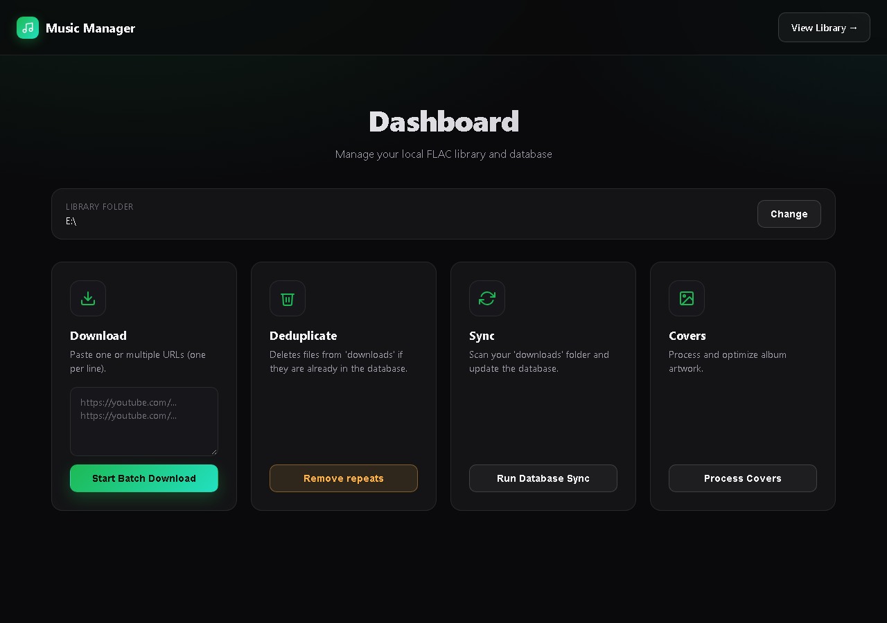
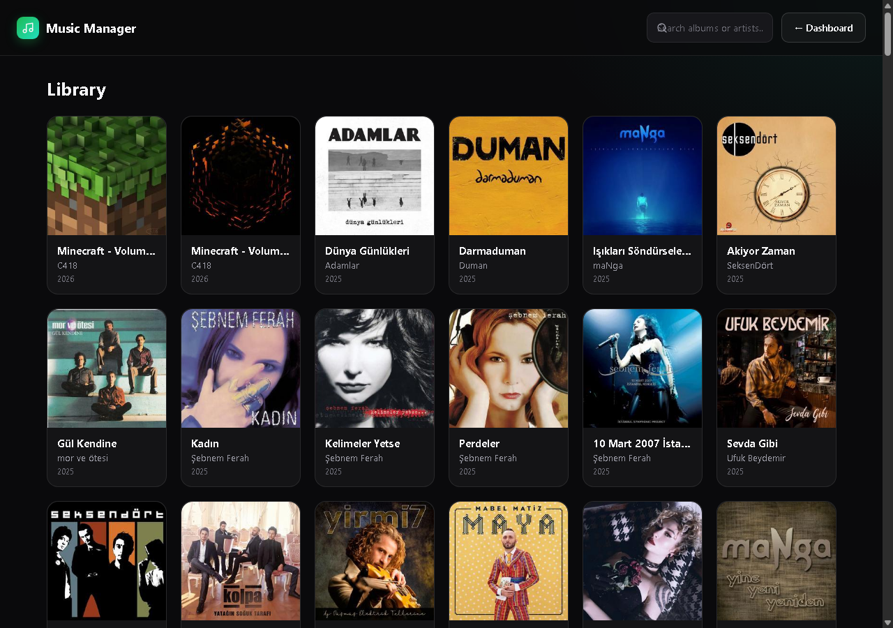
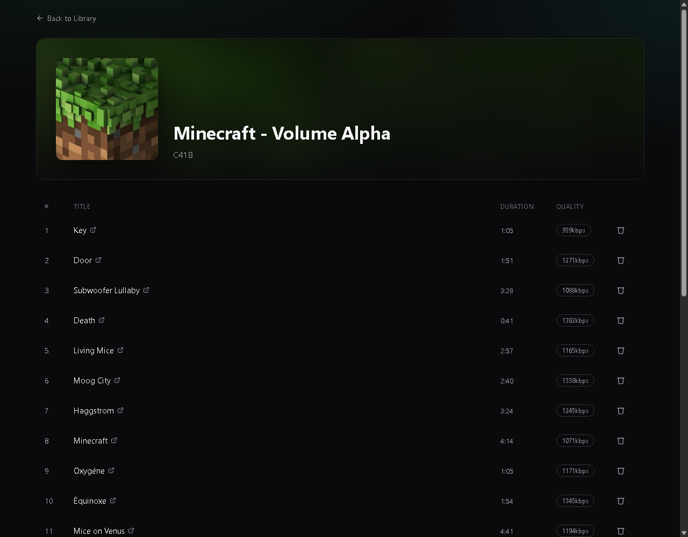

# 🎵 YouTube FLAC Downloader

A web-based tool to download high-quality music from YouTube and manage a local digital library.
This program specifically designed to download music to fioo snowsky echo mini

## Database

No server, no setup. The "Library" and "Album" views are backed by a local SQLite file, `library.db`, created automatically at the project root the first time you run the app. Album covers are saved alongside it as plain JPEG files in `static/covers/`.

## Screenshots

### Dashboard
Pick your library folder with the built-in folder browser, then download, sync, deduplicate, or process covers — all from one page.


### Library
Every synced album, browsable and searchable.


### Album
Track list with duration, bitrate, and a link back to the original source video.


## 🛠️ Quick Start

### 1. Install Requirements
```bash
pip install -r requirements.txt
```
### 2. Launch the App
```bash
python app.py
```
Once running, open your browser to: http://127.0.0.1:5000

### 3. Set Your Library Folder
On the Dashboard, click **Change** next to "Library Folder" and browse to wherever your music should live. This is saved automatically and used right away — no restart needed, and no more hardcoded `downloads/` folder.

----
## 🌐 The Interface Layer
These files handle everything the user sees in their browser.

#### app.py
The heart of the web server. It routes user requests (like clicking "Download") to the backend, uses SocketIO to send live updates back to your screen without refreshing the page, and exposes the folder-browser endpoints (`/browse_folders`, `/set_library_folder`) behind the Dashboard's folder picker.

#### templates/
Contains the HTML structure for your pages (main, library, and album).

#### Static/style.css
The design file that makes the website look clean and organized.

----
## ⚙️ The Backend Engine
Located mostly in core/, these scripts do the heavy lifting.

#### main.py
The "Boss" script. It coordinates between the web server and the individual processing tasks, always reading the current library folder from the database so a change takes effect immediately.

#### playlistDownloader.py
Controls yt-dlp.exe. It manages the download queue and ensures files are saved with the correct naming convention.

#### checkDependencies.py
A safety script that runs at startup. If it doesn't see ffmpeg or yt-dlp in your folder, it uses curl to download them for you automatically.

#### processAlbumCover.py
The "Artist" script. It extracts the cover art from the music file, crops it into a perfect square, resizes it to 250x250, and cleans up the "Artist" tags so your library looks professional.

#### cleanupManager.py
The "Janitor." It scans for duplicate songs and makes sure you don't have multiple copies of the same track cluttering your drive.


## 🗄️ The Storage & Data Layer

These files manage how your music is saved and remembered.

#### database/databaseConnector.py
Opens the local SQLite file (library.db) and creates the schema automatically if it doesn't exist yet. Also stores app settings — currently just your chosen library folder — in a small `settings` table.

#### database/syncLibrary.py
The "Librarian." It looks at the files in your library folder and writes their information (title, bitrate, duration) into the SQL tables, saving cover art as a JPEG in static/covers/.

#### sqlFiles/database.sql
The blueprint, kept for reference. This is the schema databaseConnector.py builds automatically in library.db.

#### static/covers/
Where processed 250x250 album cover JPEGs live, one per album (`<album_id>.jpg`).

#### downloads/
The default library folder where your music lives if you haven't picked a different one on the Dashboard. Organized by Playlist Name / Track Number - Title.flac.

## 🔑 Configuration
#### .gitignore
A list that tells Git to ignore temporary files, library.db, generated covers, and your actual music downloads so your GitHub repository stays small and clean.

Developed by bohrtein
